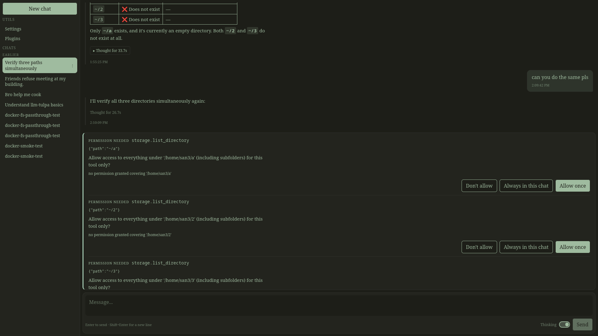
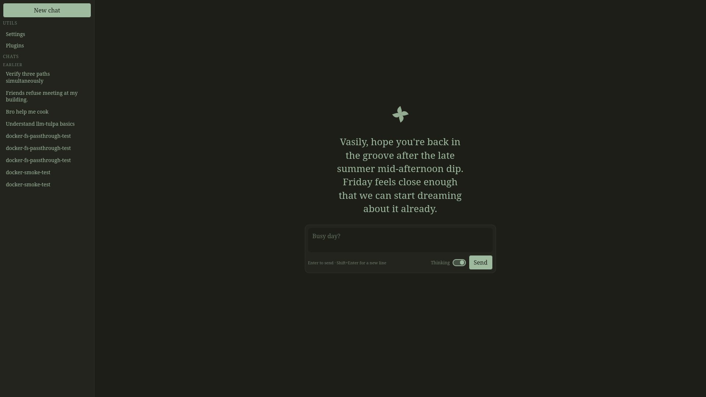
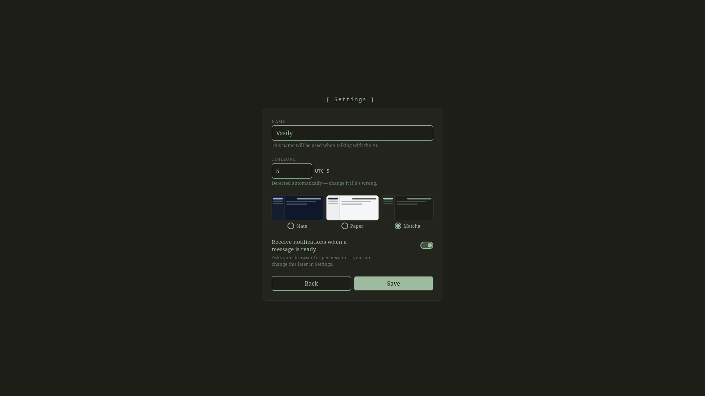
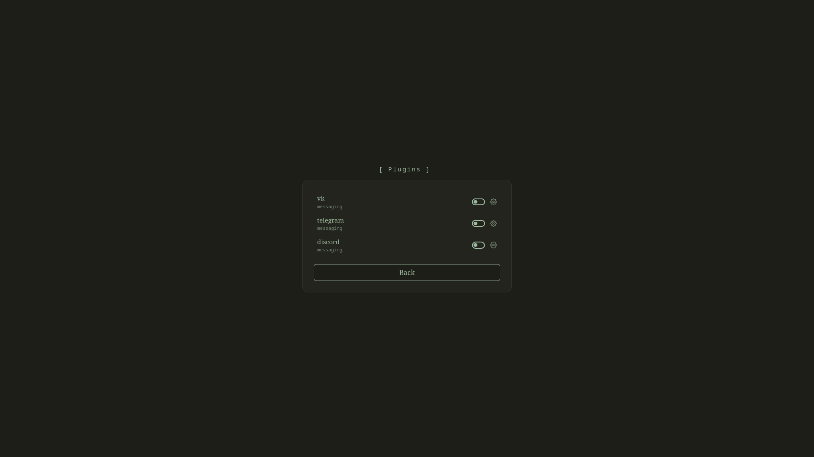

# llm-tulpa
A local-first LLM chat agent with real tool-calling — reads/writes files, inspects the machine it runs on, gated behind a permission system so nothing actually happens without your say-so. Rust/axum backend, React frontend, Ollama for inference — nothing leaves your machine.

<p align="center">
  
</p>
<p align="center"><em>Asked to check three paths at once — the agent reasons about it (collapsed above), then stops to ask permission before each <code>storage.list_directory</code> call.</em></p>

## Quickstart
1. Get a model — anything Ollama can run that supports tool calling works, but this project was built and tested against **[Qwen3.6-35B-A3B](https://huggingface.co/unsloth/Qwen3.6-35B-A3B-GGUF)**, specifically the `UD-Q4_K_XL` quant (`Qwen3.6-35B-A3B-UD-Q4_K_XL.gguf`). Drop the `.gguf` in `llm/`, and if the filename doesn't match `llm/compose.yaml`'s default, set `MODEL_FILE` to it (a `.env` file in `llm/` is the easiest way — see [`llm/README.md`](./llm/README.md)).
2. ```bash
   git clone https://github.com/SAANN3/llm-tulpa
   cd llm-tulpa
   HOST_UID=$(id -u) HOST_GID=$(id -g "$(whoami)") docker compose up -d
   ```
3. Open `http://localhost:5173`.

## Features
- Persistent chat history — every conversation, resumable across restarts.
- Real tool-calling: reads/writes files, inspects hardware and disk space — see [`backend/TOOLS.md`](./backend/TOOLS.md). Anything that can actually change something is permission-gated per tool (e.g. `storage.write_file` asks per folder); nothing runs without approval.
- Automatic history compaction, so a long or tool-heavy conversation doesn't blow the model's context window.
- Plugin system — talk to the agent from Telegram, Discord, or VK, each configured from its own settings panel — see [`backend/PLUGINS.md`](./backend/PLUGINS.md).
- Runs entirely on your own hardware via Ollama — no API keys, nothing sent anywhere.
- A few themes to pick from (Slate / Paper / Matcha) — will expand in the future!

## Screenshots
| | | |
|:---:|:---:|:---:|
| <br><sub>Home — a fresh chat starts with a generated greeting, ready to type.</sub> | <br><sub>Settings — name, timezone, and a theme picker with a live mini-preview of each theme.</sub> | <br><sub>Plugins — enable Telegram, Discord, or VK to talk to the agent from your own chat app.</sub> |

## Why this model
llm-tulpa runs one local model at a time via Ollama — any tool-calling-capable model works, but it's worth knowing why this one specifically: it's a mixture-of-experts model, and despite its size, only a fraction of its weights are actually active per token. On a VRAM-constrained card that mattered more than raw parameter count — a same-generation *dense* model of comparable size, mostly spilled to system RAM, ran at a barely-usable ~1.5 tokens/sec here, while the MoE model held nearly the same speed as a much smaller dense model (~8 t/s) while clearly outperforming it on real tasks (long single-shot generations, multi-step reasoning). If you're VRAM-constrained, it's worth looking for an MoE quant before ruling out anything bigger than what fits entirely in VRAM.

## This setup
- OS: Arch Linux
- GPU: AMD RX 5600 XT — 6GB VRAM, gfx1010/RDNA1
- CPU: AMD Ryzen 5 3600 — 6 cores / 12 threads
- RAM: 39GB

ROCm support for this GPU is rough, but Ollama's own GPU passthrough works fine in practice regardless. If you're on Nvidia this is all moot; if you're on AMD and assuming GPU inference is off the table because of ROCm's reputation, it's worth just trying Ollama's passthrough before writing it off.

## Docs
- [`backend/README.md`](./backend/README.md) + [`backend/TOOLS.md`](./backend/TOOLS.md) + [`backend/PLUGINS.md`](./backend/PLUGINS.md) — the Rust backend, how the tool system works, and how the plugin system works.
- [`frontend/README.md`](./frontend/README.md) + [`frontend/THEMING.md`](./frontend/THEMING.md) — the React frontend, and how theming works.
- [`llm/README.md`](./llm/README.md) — swapping models, changing the context window.
- [`CHANGELOG.md`](./CHANGELOG.md) — what changed, release by release.

## License
Copyright (c) 2026 Blinov Vasily

This project is licensed under the MIT license ([LICENSE] or <http://opensource.org/licenses/MIT>)

[LICENSE]: ./LICENSE
