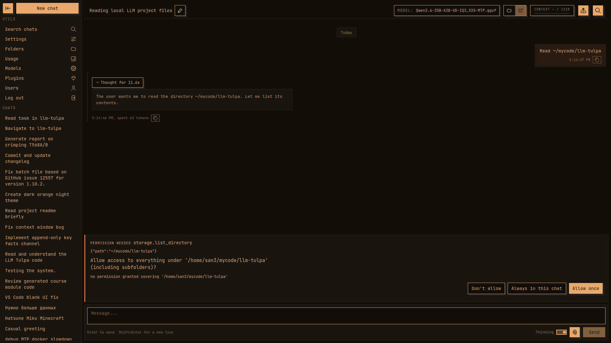
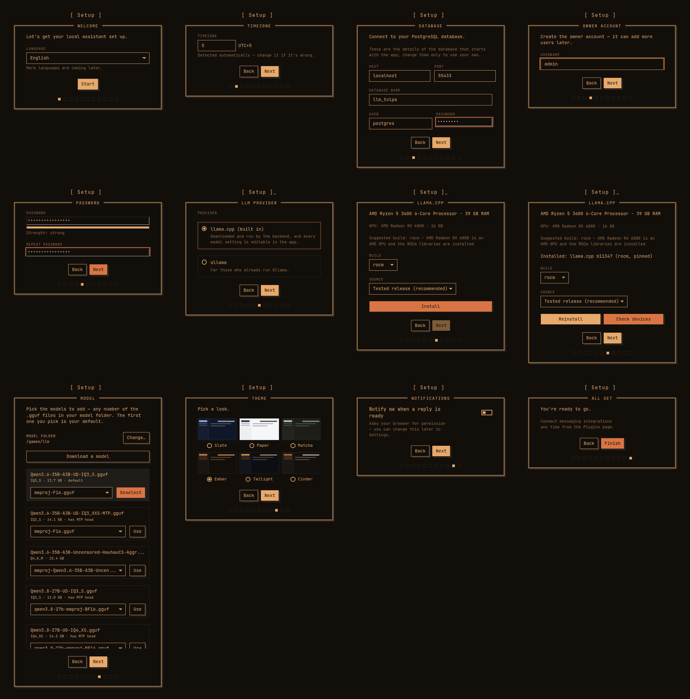
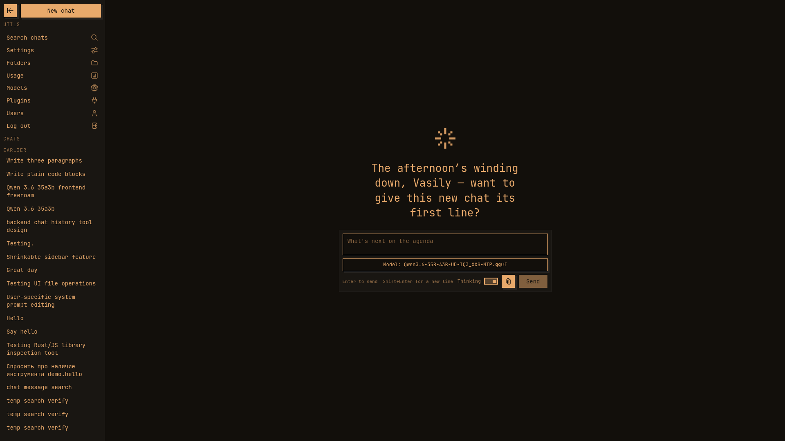
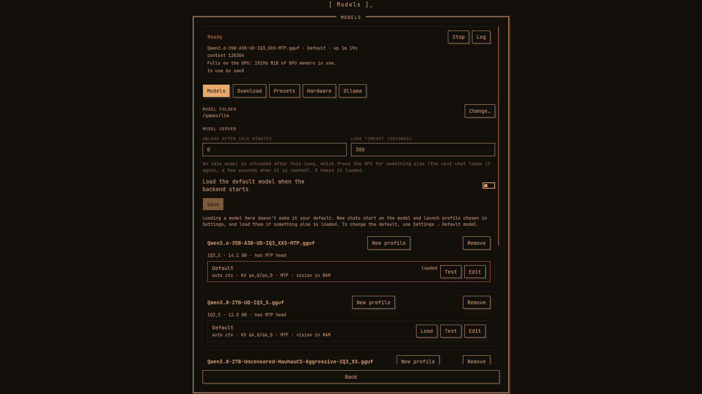
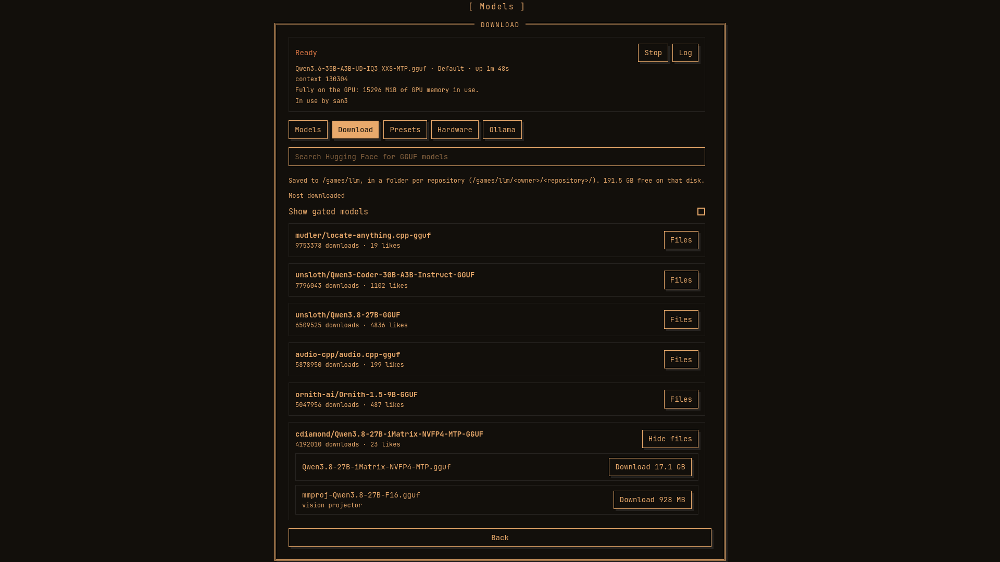
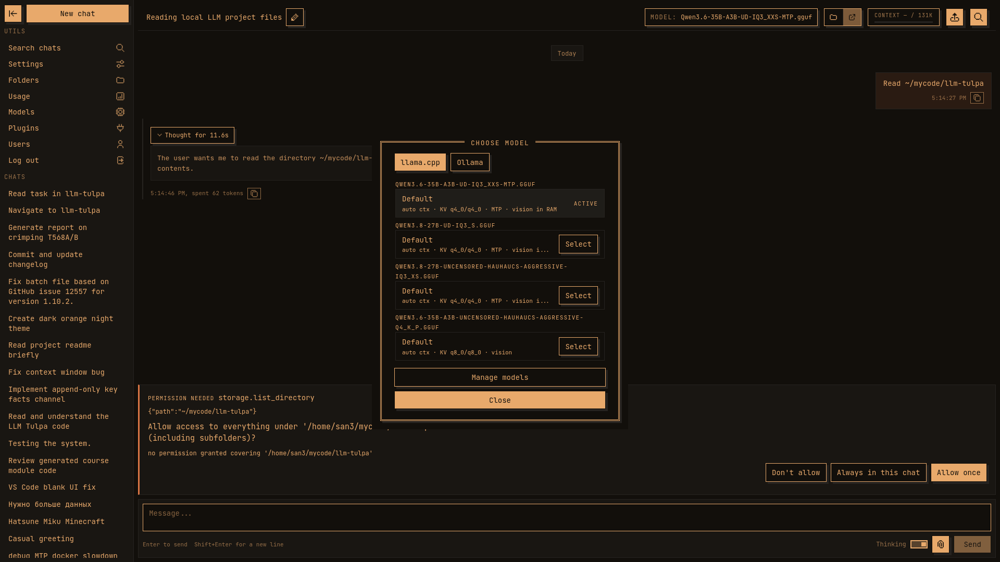
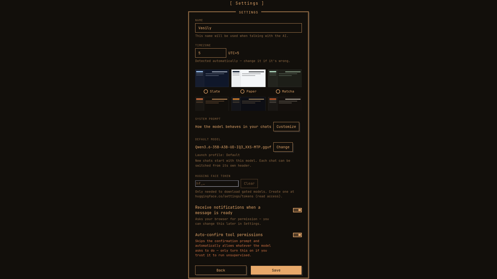
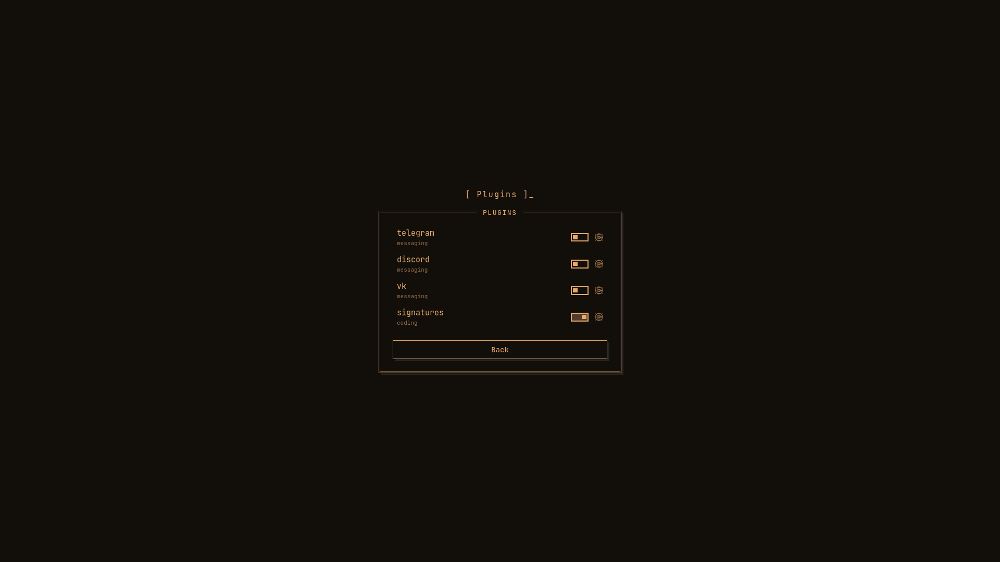

# llm-tulpa
A local-first LLM chat agent with real tool-calling — reads/writes files, inspects the machine it runs on, gated behind a permission system so nothing actually happens without your say-so. Rust/axum backend, React frontend, llama.cpp for inference (Ollama optional) — nothing leaves your machine.

<p align="center">
  
</p>
<p align="center"><em>Asked to read a project folder — the agent thinks about it (collapsed above), then stops to ask permission before running <code>storage.list_directory</code>.</em></p>

## Set up in the app, not in config files
llm-tulpa runs its own model server, and the setup happens on screen:
- **One command starts everything**, then a setup wizard takes over: the database, your owner account, a theme.
- **It looks at your hardware**, picks the llama.cpp build that suits it (CPU, Vulkan, ROCm or CUDA), tells you what library is missing if one is, and downloads and checks it for you.
- **Models come from a folder or from Hugging Face:** pick a `.gguf` you already have, or search and download one on the Models page, with your own Hugging Face token for gated ones.
- **Every model setting is a screen**, per model: context size, KV cache, GPU layers, MTP speculative decoding, the vision projector and where it runs, and sampling presets (temperature and friends) you can export and share.

No environment variables to set, no `llama-server` flags to remember, nothing to edit by hand for a normal install.

<p align="center">
  
</p>
<p align="center"><em>The whole setup, in order: a name and password, your hardware's llama.cpp build, and the model to start with.</em></p>

## Quickstart
```bash
git clone https://github.com/SAANN3/llm-tulpa
cd llm-tulpa
./start-docker.sh
```
Then open `http://localhost:5173` and follow the setup wizard. You need Docker; `./start-docker.sh` finds your GPU by itself.

The Docker image runs the Vulkan build of llama.cpp, which works on any GPU but is several times slower than ROCm (AMD) or CUDA (Nvidia): about 25 tokens/s against about 100 on one 16 GB AMD card with Qwen3.6-35B-A3B. For full speed run the backend on the host with `./start-native.sh` (see the details below).

<details>
<summary>The details: models, what the wizard asks, and running without Docker for ROCm or CUDA speed</summary>

**A model.** Anything llama.cpp can run that supports tool calling works, but this project was built and tested against **[Qwen3.6-35B-A3B](https://huggingface.co/unsloth/Qwen3.6-35B-A3B-GGUF)**, specifically the `UD-Q4_K_XL` quant (`Qwen3.6-35B-A3B-UD-Q4_K_XL.gguf`). Drop the `.gguf` in `llm/` (or a folder you point `MODEL_DIR` at), or search and download one from Hugging Face on the app's Models page. The app downloads and runs llama.cpp itself: the setup wizard looks at your hardware, installs the right build and has you pick the model file; every model setting (context, KV cache, GPU layers, MTP, vision projector, sampling) is editable in the app afterwards. Ollama still works as a second provider (`--profile ollama`; see [`llm/README.md`](./llm/README.md)).

**The wizard.** On first run, at `http://localhost:5173`, a setup wizard walks you through it — timezone, an **owner account** (username + password), the model server (it looks at your hardware, suggests the right llama.cpp build, downloads it — or uses a `llama-server` you point it at — and has you pick the model file), a theme, and notifications. With Postgres from the bundled compose file, the wizard's database step is one form (`localhost`, port `5432`, user/password `postgres`); the connection is saved to `backend/data/settings.json`, which also holds every other backend setting — see [`backend/README.md`](./backend/README.md). After setup you sign in with the owner account; the owner can add more users from the in-app Users page (there's no open self-registration), and each user's chats and settings are their own.

### Running the backend natively (for ROCm or CUDA speed)
The Docker image has the Vulkan build of llama.cpp, which works everywhere but is several times slower than ROCm (AMD) or CUDA (Nvidia). For the full speed run the backend on the host and keep the database, SearXNG and the frontend in Docker:
```bash
./start-native.sh
```
It starts those three in Docker (and stops the backend container), then runs `cargo run --release`, which rebuilds only what changed — the first build takes several minutes. Its settings live in `backend/data-native/settings.json`, apart from the Docker ones; a first run seeds that file from `backend/data/settings.json` (database block and secret included) with `model_dir` taken from `MODEL_DIR` in your `.env` (or choose the folder in the app), and `target/release/data` is a link to that folder, so a `cargo clean` doesn't take your settings with it. Open `http://localhost:5173`; in the setup wizard's llama.cpp step the suggested build is ROCm or CUDA when the host has its libraries (for AMD, `hipblas` — the wizard names what is missing). Run only one backend at a time: `./start-docker.sh` refuses to start while a native one runs, and `./start-native.sh` stops the container.

</details>

## Features
- Persistent chat history — every conversation, resumable across restarts.
- Real tool-calling: reads/writes files, inspects hardware and disk space, runs shell commands, downloads files and makes HTTP requests, searches the web via a local SearXNG instance — see [`backend/TOOLS.md`](./backend/TOOLS.md). Anything that can actually change or expose something is permission-gated (e.g. `storage.write_file` asks per folder, `web.request` asks per host); nothing runs without approval. Auto-confirm mode (Settings) resolves those prompts automatically instead, for letting it run a task unsupervised.
- Under Docker, the backend's own container ships a real general-purpose toolkit for shell commands to actually use — Python, Node, Go, Rust, a headless (or, with a display server passed through, real on-screen) Chromium via Playwright, and more — plus the ability to install anything else on top on request.
- File attachments — drag-and-drop or pick any file type onto the composer; previews for PDFs, Office docs, spreadsheets/CSVs, code (syntax-highlighted), and plain text, and the model can read an attached file's actual content on request.
- Automatic history compaction, so a long or tool-heavy conversation doesn't blow the model's context window.
- Background jobs — the model can start a long-running command (a dev server, a big build) as a job with its own log, and is told in the chat when it finishes, so it can end its turn instead of waiting. With the chat open, the reply to that notice starts on its own — see [`backend/TOOLS.md`](./backend/TOOLS.md).
- Sub-agents — the model can hand a long search or research task to a sub-agent with a chat of its own, so the work doesn't fill the conversation's context; the result comes back as a message in the chat when it finishes, and the sub-agent's chat opens from the tool call — see [`backend/TOOLS.md`](./backend/TOOLS.md).
- A quick launcher (`extensions/launcher`) — a small always-on-top input bar that starts a chat from your desktop without opening the browser first — see [its README](./extensions/launcher/README.md).
- Vision — attach images to a message from the composer, send a photo through a messaging plugin, or have the model look at an image it found itself via a file path, when running a vision-capable model — see [`llm/README.md`](./llm/README.md).
- Plugin system — talk to the agent from Telegram, Discord, or VK, each configured from its own settings panel — see [`backend/PLUGINS.md`](./backend/PLUGINS.md).
- Multi-user with an owner account — each user's chats and settings are their own; the owner manages the rest.
- llama.cpp runs inside the backend: it is downloaded for your hardware, started on the first request, switched between **launch profiles** (context size, KV cache, GPU layers, MTP speculative decoding, vision projector) and unloaded when idle. A **Models page** has the models and their profiles, Hugging Face search and download, per-user **sampling presets** (temperature and friends, with templates and export/import), and what llama.cpp sees of your hardware. Ollama still works as a second provider.
- Switch the model per chat from the chat header — one chooser with a tab per provider. A model change takes effect with the next prompt, never in the middle of a running turn, and a request that needs another model waits for the one in progress instead of cutting it off.
- Runs entirely on your own hardware — no API keys, nothing sent anywhere (a Hugging Face download talks to Hugging Face, only when you ask for one).
- Themes to pick from — Slate, Paper, Matcha, and the warm dark Ember, Twilight and Cinder — will expand in the future!

## Screenshots
| | | |
|:---:|:---:|:---:|
| <br><sub>Home — a fresh chat starts with a generated greeting, and the model for it can be picked right there.</sub> | <br><sub>Models — what is loaded and where it went, each model's launch profiles with Load, Test and Edit.</sub> | <br><sub>Download — search Hugging Face and download into your model folder; the free space is shown.</sub> |
| <br><sub>Choose model — one chooser with a tab per provider, each launch profile with its settings.</sub> | <br><sub>Settings — name, timezone, a theme picker with a live mini-preview, and the default model with its launch profile.</sub> | <br><sub>Plugins — enable Telegram, Discord, or VK to talk to the agent from your own chat app.</sub> |

## Why this model
llm-tulpa runs one local model at a time — any tool-calling-capable model works, but it's worth knowing why this one specifically: it's a mixture-of-experts model, and despite its size, only a fraction of its weights are actually active per token. On a VRAM-constrained card that mattered more than raw parameter count — a same-generation *dense* model of comparable size, mostly spilled to system RAM, ran at a barely-usable ~1.5 tokens/sec on the 6GB card this project started on, while the MoE model held nearly the same speed as a much smaller dense model (~8 t/s there) while clearly outperforming it on real tasks (long single-shot generations, multi-step reasoning). If you're VRAM-constrained, it's worth looking for an MoE quant before ruling out anything bigger than what fits entirely in VRAM.

## This setup
- OS: Arch Linux
- ~~GPU: AMD RX 5600 XT — 6GB VRAM, gfx1010/RDNA1~~ *(old)*
- GPU: AMD RX 6800 — 16GB VRAM, gfx1030/RDNA2
- CPU: AMD Ryzen 5 3600 — 6 cores / 12 threads
- RAM: 39GB

Writing speed on this card, MTP on, 8-bit KV cache, flash attention, context sized automatically (mean of five runs over three code prompts — a long conversation is slower):

| Model | ROCm (native) | Vulkan (Docker image) |
|---|---|---|
| Qwen3.6-35B-A3B `UD-IQ3_XXS-MTP` | ~100 tok/s (context ~90k) | ~25 tok/s (~52k) |
| Qwen3.8-27B `UD-IQ3_S` | ~36 tok/s (~65k) | ~11.5 tok/s (~46k) |

ROCm needs the host's `hipblas` (the setup wizard says when it is missing) and the llama.cpp ROCm build, so for the best speed on an AMD card run the backend natively; the Docker image has Vulkan, which works without extra libraries. On Nvidia the CUDA builds are offered the same way.

## Docs
- [`backend/README.md`](./backend/README.md) + [`backend/TOOLS.md`](./backend/TOOLS.md) + [`backend/PLUGINS.md`](./backend/PLUGINS.md) — the Rust backend, how the tool system works, and how the plugin system works.
- [`frontend/README.md`](./frontend/README.md) + [`frontend/THEMING.md`](./frontend/THEMING.md) — the React frontend, and how theming works.
- [`llm/README.md`](./llm/README.md) — swapping models, changing the context window.
- [`CHANGELOG.md`](./CHANGELOG.md) — what changed, release by release.
- [`AGENTS.md`](./AGENTS.md) — for an AI coding agent working in this repo.

## License
Copyright (c) 2026 Blinov Vasily

This project is licensed under the MIT license ([LICENSE] or <http://opensource.org/licenses/MIT>)

[LICENSE]: ./LICENSE
